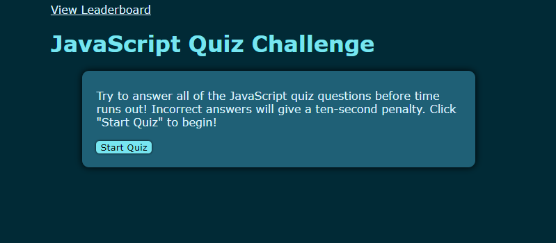
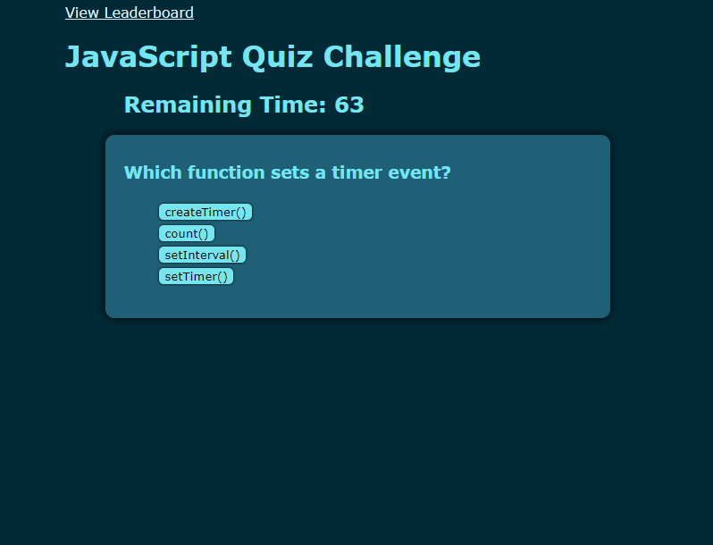
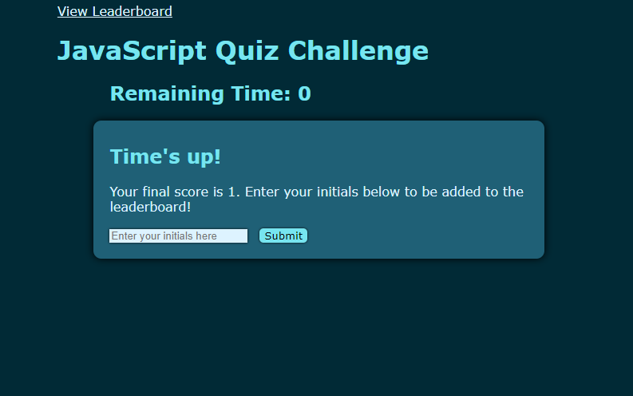
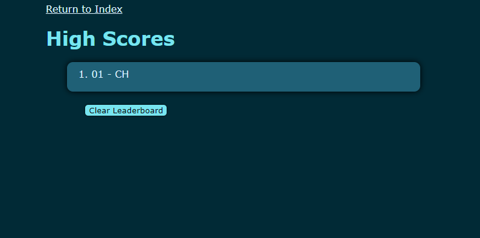

# JavaScript Quiz
## Description
This project is a web-based quiz on various JavaScript concepts centered around Web APIs. It functions as a revision and testing tool for people studying the subject.

## Installation
The webpage is hosted online and can be accessed using the following link: https://christiehyde.github.io/JavaScriptQuiz/

## Usage

Upon loading the webpage, users can click the Start Quiz button to begin the timed quiz. The quiz consists of questions shown at the top of the section, and four answer buttons a user can click to proceed to the next question. Clicking an answer will display a temporary message showing whether the answer was correct or incorrect. The timer will suffer a penalty if the answer is incorrect.

At the end of the quiz or when the timer reaches 0, the user will be shown their score, which is equal to the number of questions they got correct. They can enter their initials to be added to the leaderboard, which is local to the user's browsing environment.

Submitting the initials will take the user back to the default page. From here, the user can navigate to the leaderboard page, where they can view the previous scores that were saved. The leaderboard can be cleared by clicking the Clear Leaderboard button.

## Credits
All HTML, CSS and JavaScript was written by Christie Hyde for this project.